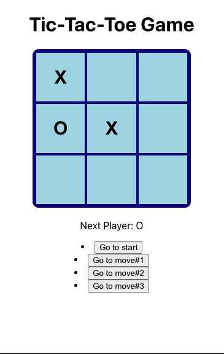

# Tic-Tac-Toe Game with React Hooks

This was a self-initiated project for learning React Hooks. This project was bootstrapped with [Create React App](https://github.com/facebook/create-react-app).

## Available Scripts

In the project directory, you can run:

### `npm start`

Runs the app in the development mode.\
Open [http://localhost:3000](http://localhost:3000) to view it in the browser.

## Screenshot

## Summary

This app was built with the purpose of learning React Hooks and the class was taught by [Thomas Weibenfalk](https://scrimba.com/learn/reactgame). It is very similar to the tutorial from the official React documentation but implements the 'useState' hook instead of the 'setState' method. To play the game, users can click on the squares the the page will display the next player or the winner and a history of the moves. 

## Built With

* React
* JavaScript